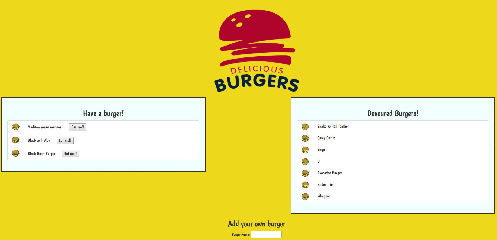

# Burger Restaurant

### Overview

Burger Restaurant is a full-stack single page application built to practice and integrated the use of multiple web development techniques. 

Users are able to input the names of burgers they'd like to eat, log it onto a menu, and when eaten, the burgers move to a different part of the screen displaying a list of devoured burgers.

### Technologies and Techniques Used

* Node.js - an event-driven, asynchronous JavaScript open source server framework

* NPM packages - Including express, for creating the server; mysql, for interacting with the SQL database; body-parser, for interpreting and reading data; method-override; and express-handlebars.

* MySQL Workbench - for creating the local database connection

* Handlebars - a JavaScript templating framework to manage the display of data returned by the server

* MVC design - Model View Controller refers to a method of structuring a web development project into disticnt but interconnected parts increasing efficiency and resusability of code.

* ORM - Object Relational Mapping is a technique of accessing relational databases and manages an application's CRUD interactions with a database.

* Heroku - the cloud platform used to deploy the application

See a screenshot below for a glimpse of the final product, or click [here](https://glacial-plains-20153.herokuapp.com) to view and use live app.

